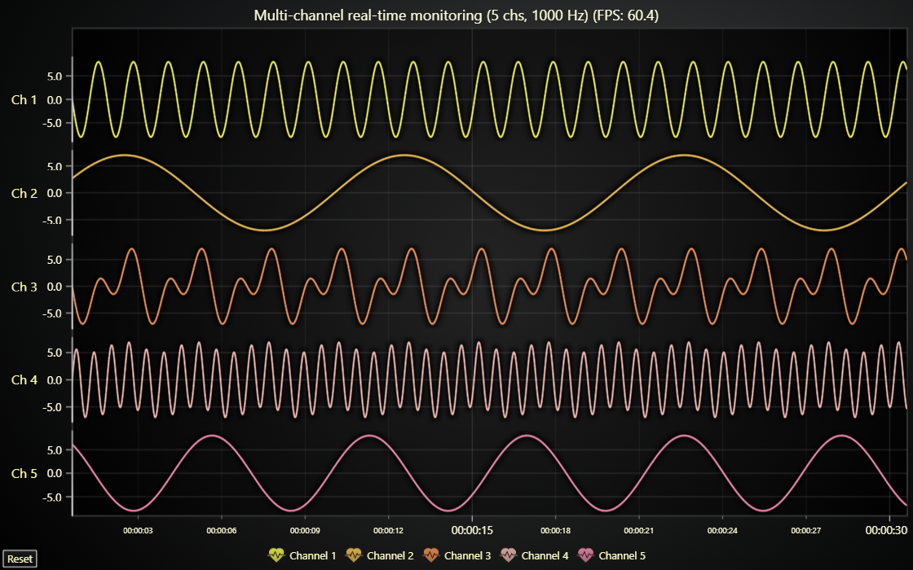

# Multi-channel real-time data monitoring JavaScript Chart

This demo application belongs to the set of examples for LightningChart JS, data visualization library for JavaScript.

LightningChart JS is entirely GPU accelerated and performance optimized charting library for presenting massive amounts of data. It offers an easy way of creating sophisticated and interactive charts and adding them to your website or web application.

The demo can be used as an example or a seed project. Local execution requires the following steps:

-   Make sure that relevant version of [Node.js](https://nodejs.org/en/download/) is installed
-   Open the project folder in a terminal:

          npm install              # fetches dependencies
          npm start                # builds an application and starts the development server

-   The application is available at _http://localhost:8080_ in your browser, webpack-dev-server provides hot reload functionality.

## Description

Lightning-fast Line Chart visualization over multiple high speed (1000 Hz) trends that progress along the same scrolling Time X Axis.

Widely used in all kinds of fields for monitoring live data from many (hundreds or even thousands) of data sources at the same time.

Frames rendered per second (FPS) is recorded live, and displayed on the chart title. FPS of 40-60 indicates a smooth running performance.

This line chart uses smooth anti-aliased thick lines for the best visual look, which is pretty GPU heavy with high data rates.
For a lighter alternative you can check out [a similar line chart with best-performance graphics](https://lightningchart.com/lightningchart-js-interactive-examples/examples/lcjs-example-0010-multiChannelLineProgressive.html)

## Automatic Data Cleaning

One of the most ground breaking features of LightningChart JS is _automatic data cleaning_.

Because LightningChart JS is designed for real-time data streaming solutions, it is essential that old, out of view data is automatically cleaned in the most performant manner.

In practice, this results in an application where you can even scroll back for some distance and see older data, but if you scroll far enough, you will find that the old data has been cleaned. This allows the application to run _forever_!

## Several times proven performance leader in JS charting

LightningChart is the pioneer group among JavaScript chart providers who started the study of data visualization performance comparison.
This activity is based on open-source applications that test several different charting tools with an identical use case.

During the test, different metrics of performance are measured which indicate how efficiently the data visualization software performs. Common metrics are:

-   _Refresh rate_ (FPS), how rapidly the displayed visualization is updated as times per second.
-   _CPU usage_ (%), how much of available computing resource is utilized.
    -   This is very important, because almost entirety of the computing power allocated to browsing a single web page is SHARED between all the content on the web page.
    -   In simple terms, if you have a badly performing chart on your web page then it means your whole page will perform bad.
-   _Data amount_, how much data can be shown. In practice, limitations could be imposed on how long history can be displayed or how precisely the data can be visualized.

**Since November 2021**, LightningChart JS has dominated all performance tests which have since covered a large set of data visualization use cases in various industries:

-   [_Static line graphs_](https://lightningchart.com/lightningchart-js-interactive-examples/examples/lcjs-example-0017-largeLineChartXY.html) | These days LightningChart loads far larger data sets and over 50 times faster than your average web chart.

-   [_Real-time line charts_](https://lightningchart.com/lightningchart-js-interactive-examples/examples/lcjs-example-0010-multiChannelLineProgressive.html) | In the original motivation for its development, LightningChart JS performs over **500000** times more efficiently than the average JS chart - processing tens of thousands more data samples, using 4 times less processing power and refreshing 7 times in the same time others do just once.

-   [_Heatmap charts_](https:/lightningchart.com/lightningchart-js-interactive-examples/examples/lcjs-example-0803-scrollingHeatmap.html) | Traditional JS heatmaps can be used to visualize small grids with total of 1000 data points and under. LCJS enables visualization of BILLION large data sets that could cover for example large geographical areas such as entire countries.

**Find all the information of open-source LightningChart JS performance studies on our** [web page](https://lightningchart.com/high-performance-javascript-charts/)!

## API Links

* [XY cartesian chart]
* [Line series]
* [Data patterns]
* [Axis]

## Support

If you notice an error in the example code, please open an issue on [GitHub][0] repository of the entire example.

Official [API documentation][1] can be found on [LightningChart][2] website.

If the docs and other materials do not solve your problem as well as implementation help is needed, ask on [StackOverflow][3] (tagged lightningchart).

If you think you found a bug in the LightningChart JavaScript library, please contact sales@lightningchart.com.

Direct developer email support can be purchased through a [Support Plan][4] or by contacting sales@lightningchart.com.

[0]: https://github.com/Arction/
[1]: https://lightningchart.com/lightningchart-js-api-documentation/
[2]: https://lightningchart.com
[3]: https://stackoverflow.com/questions/tagged/lightningchart
[4]: https://lightningchart.com/support-services/

© LightningChart Ltd 2009-2022. All rights reserved.

[XY cartesian chart]: https://lightningchart.com/js-charts/api-documentation/v7.1.0/classes/ChartXY.html
[Line series]: https://lightningchart.com/js-charts/api-documentation/v7.1.0/classes/LineSeries.html
[Data patterns]: https://lightningchart.com/js-charts/api-documentation/v7.1.0/interfaces/DataPattern.html
[Axis]: https://lightningchart.com/js-charts/api-documentation/v7.1.0/classes/Axis.html

